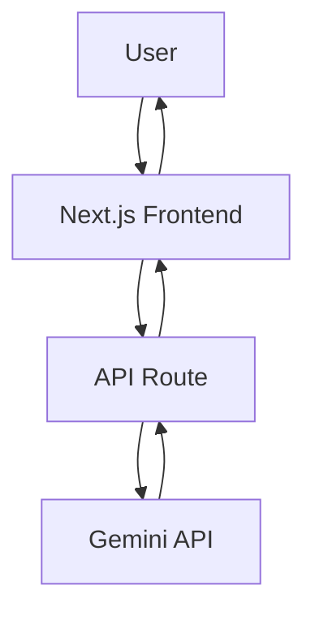

# 🚀 PostCraft AI

> Generate engaging, professional, and high-performing LinkedIn posts in seconds using AI.

PostCraft AI helps creators, founders, marketers, and professionals transform ideas into polished LinkedIn content with customizable writing styles and AI-powered suggestions.


---

## 🔗 Quick Links

- [Features](#-features)
- [Tech Stack](#-tech-stack)
- [Architecture](#-architecture)
- [Quick Start](#-quick-start)
- [Usage](#-usage)
- [Roadmap](#-roadmap)
- [Contributing](#-contributing)

---

## 🎯 Why PostCraft AI?

Writing consistent and engaging LinkedIn content can be challenging.

PostCraft AI helps you:

- Save hours spent writing posts
- Overcome writer's block
- Maintain posting consistency
- Generate content instantly
- Experiment with multiple writing styles
- Improve engagement through AI-generated content

Whether you're a student, developer, founder, creator, or marketer, PostCraft AI helps you create better content faster.

---

## ✨ Features

### 🤖 AI-Powered Content Generation

Generate complete LinkedIn posts from a simple idea or topic.

### 🎭 Multiple Writing Styles

Create content in different tones and formats.

- Professional
- Storytelling
- Thought Leadership
- Casual
- Educational

### ⚡ Fast Generation

Receive high-quality content within seconds.

### 🎯 Engagement-Oriented Writing

Generate posts designed for readability and audience engagement.

### 📋 One-Click Copy

Quickly copy generated content and publish it on LinkedIn.

### 📱 Responsive Design

Optimized for desktop, tablet, and mobile devices.

---

## 🛠 Tech Stack

| Category | Technology |
|-----------|------------|
| Frontend | Next.js |
| Language | TypeScript |
| Styling | Tailwind CSS |
| AI Model | Google Gemini |
| UI Components | Shadcn/UI |
| Deployment | Vercel |

---

## 🏗 Architecture



### Workflow

1. User enters a topic or idea
2. Frontend sends request to API
3. Gemini processes prompt
4. AI generates LinkedIn content
5. Response displayed instantly

---

## 📂 Project Structure

```bash
PostCraft-AI/
│
├── src/
│   ├── app/
│   ├── components/
│   ├── lib/
│   ├── services/
│   └── types/
│
├── public/
├── docs/
├── package.json
└── README.md
```

---

## ⚡ Quick Start

### Clone Repository

```bash
git clone https://github.com/priyam-10/PostCraft-AI.git
```

### Navigate to Project

```bash
cd PostCraft-AI
```

### Install Dependencies

```bash
npm install
```

### Start Development Server

```bash
npm run dev
```

Open:

```text
http://localhost:3000
```

---

## 🔐 Environment Variables

Create a `.env.local` file in the project root.

```env
GEMINI_API_KEY=your_gemini_api_key
```

Get your API key from Google AI Studio.

---

## 📖 Usage

### Step 1

Enter a topic or idea.

Example:

```text
How AI is changing software development
```

### Step 2

Select your preferred writing style.

### Step 3

Click **Generate Post**.

### Step 4

Review and copy the generated content.

### Step 5

Publish directly on LinkedIn.

---

## 💡 Example Output

### Input

```text
Benefits of Open Source Contributions
```

### Generated Post

```text
Most developers underestimate the impact of open-source contributions.

A single pull request can:

• Improve your coding skills
• Expand your network
• Strengthen your portfolio
• Help thousands of users

The best time to start contributing was yesterday.
The second-best time is today.

What's stopping you from making your first contribution?
```

---

## 🗺 Roadmap

### Current

- [x] AI Post Generation
- [x] Responsive UI
- [x] Gemini Integration
- [x] Multiple Writing Styles

### Upcoming

- [ ] Post Templates
- [ ] Content History
- [ ] Saved Drafts
- [ ] LinkedIn Publishing Integration
- [ ] Analytics Suggestions
- [ ] Carousel Post Generation
- [ ] Hashtag Recommendations

---

## 🤝 Contributing

Contributions are welcome and appreciated.

### Steps

1. Fork the repository
2. Create a new branch

```bash
git checkout -b feature/amazing-feature
```

3. Commit changes

```bash
git commit -m "Add amazing feature"
```

4. Push branch

```bash
git push origin feature/amazing-feature
```

5. Open a Pull Request

---

## ❓ FAQ

### Which AI model powers PostCraft AI?

Google Gemini.

### Is user content stored?

No. Content is generated on demand.

### Can I use generated posts commercially?

Yes, generated content can be used for professional and commercial purposes.

### Is PostCraft AI free?

Yes, subject to Gemini API usage limits.

---

## 🌟 Support

If you find this project useful:

⭐ Star the repository

🍴 Fork the project

📢 Share it with others

---

## 📄 License

This project is licensed under the MIT License.

See the LICENSE file for more information.
