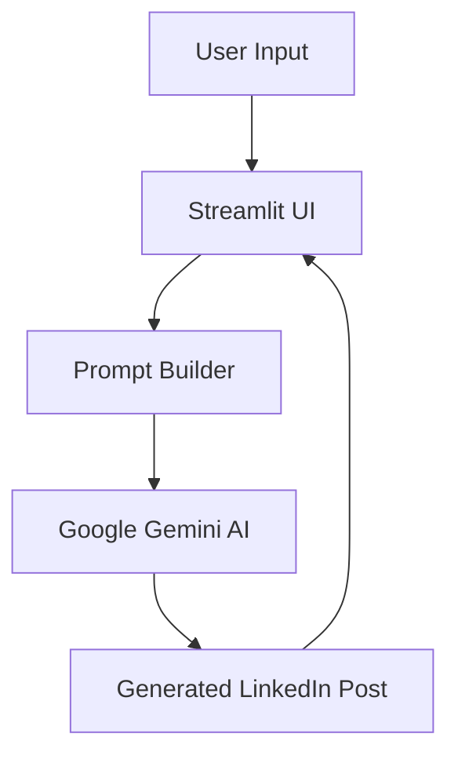

# 🪄 PostCraft-AI

> Generate professional, engaging, and audience-focused LinkedIn posts using Google Gemini AI.


---

## 🚀 Overview

PostCraft-AI is an AI-powered LinkedIn content generation platform built with **Python**, **Streamlit**, and **Google Gemini AI**.

The application helps creators, professionals, founders, marketers, recruiters, and students generate high-quality LinkedIn posts in seconds using proven copywriting frameworks, audience targeting, and customizable writing styles.

---

## Live Demo

🚀 Try the application here:

🔗 [PostCraft AI Studio](https://postcraft-ai-studio.streamlit.app/)

---

## 🎯 Why PostCraft-AI?

Creating engaging LinkedIn content consistently can be difficult.

PostCraft-AI helps you:

- ✨ Overcome writer's block
- ⏳ Save hours of content creation time
- 🎯 Target specific audiences effectively
- 📈 Improve engagement with structured copywriting frameworks
- 🧠 Generate professional content instantly
- 🔄 Experiment with different writing styles and tones

Whether you're a student, developer, founder, recruiter, marketer, or entrepreneur, PostCraft-AI helps transform ideas into compelling LinkedIn content.

---

## ✨ Features

### 📝 Smart Post Generation

Generate engaging LinkedIn posts on any topic using Google Gemini AI.

### 🎭 Multiple Writing Tones

Choose from:

- Professional
- Inspirational
- Humorous
- Funny
- Angry
- Sad

### 🎯 Audience Targeting

Customize content for specific audiences such as:

- Developers
- Founders
- Students
- Recruiters
- Marketers
- Entrepreneurs

### 📚 Copywriting Frameworks

Supports:

- AIDA (Attention, Interest, Desire, Action)
- PAS (Problem, Agitate, Solution)
- Storytelling
- Listicle
- How-To / Tips
- Custom Style

### 📏 Flexible Post Lengths

- Short (100–150 words)
- Medium (200–300 words)
- Long (400–500 words)

### 🎨 Modern Streamlit UI

- Responsive layout
- Session history
- Download generated posts
- One-click regeneration
- User-friendly interface

---

## 🏗️ Architecture



---

## 🧠 How It Works

1. User enters a topic.
2. Selects tone, audience, framework, and length.
3. Prompt Builder creates a structured prompt.
4. Gemini AI processes the request.
5. A LinkedIn-ready post is generated.
6. Streamlit displays the result.
7. User can copy, regenerate, or download the content.

---

## 📂 Project Structure

```text
PostCraft-AI/
│
├── app.py                # Streamlit UI
├── main.py               # CLI Entry Point
├── config.py             # Gemini Configuration
├── prompt_builder.py     # Prompt Engineering Logic
├── user_inputs.py        # Input Collection
│
├── requirements.txt
├── .gitignore
├── README.md
└── .env
```

---

## ⚙️ Installation

### 1️⃣ Clone Repository

```bash
git clone https://github.com/priyam-10/PostCraft-AI.git

cd PostCraft-AI
```

### 2️⃣ Create Virtual Environment

```bash
python -m venv venv
```

Activate:

#### Windows

```bash
venv\Scripts\activate
```

#### Linux / macOS

```bash
source venv/bin/activate
```

### 3️⃣ Install Dependencies

```bash
pip install -r requirements.txt
```

---

## 🔑 Setup Gemini API

Create a `.env` file in the project root:

```env
GEMINI_API_KEY=YOUR_API_KEY_HERE
```

Get your API key from:

https://aistudio.google.com/

---

## ▶️ Run Application

### Streamlit App

```bash
streamlit run app.py
```

Open:

```text
http://localhost:8501
```

---

### CLI Version

```bash
python main.py
```

---

## 💡 Example Output

### Input

```text
Benefits of Open Source Contributions
```

### Generated Post

```text
Most developers underestimate the impact of open-source contributions.

A single contribution can:

• Improve coding skills
• Expand your network
• Strengthen your portfolio
• Help thousands of users

The best way to grow as a developer isn't just consuming content.

It's building in public and contributing consistently.

Have you made your first open-source contribution yet?
```

---

## 🛠️ Tech Stack

| Technology | Usage |
|------------|--------|
| Python | Backend Logic |
| Streamlit | User Interface |
| Google Gemini AI | Content Generation |
| dotenv | Environment Variables |
| Git & GitHub | Version Control |

---

## 📈 Future Improvements

### Planned Features

- [ ] LinkedIn carousel generation
- [ ] Multi-language support
- [ ] Content scheduling
- [ ] Hashtag optimization
- [ ] Post analytics
- [ ] Export to PDF
- [ ] User authentication
- [ ] Content history
- [ ] AI-powered content suggestions

---

## ❓ FAQ

### Which AI model powers PostCraft-AI?

Google Gemini AI.

### Is my data stored?

No. The application generates content on demand and does not permanently store prompts or generated posts.

### Can I customize the writing style?

Yes. You can choose different tones, audiences, frameworks, and post lengths.

### Is PostCraft-AI free to use?

Yes, subject to Google Gemini API usage limits.

### Can I use generated content commercially?

Yes. Generated content can be used for personal, professional, and commercial purposes.

---

## 🤝 Contributing

Contributions are welcome and appreciated.

### Steps

1. Fork the repository

2. Create a feature branch

```bash
git checkout -b feature/amazing-feature
```

3. Commit your changes

```bash
git commit -m "Add amazing feature"
```

4. Push the branch

```bash
git push origin feature/amazing-feature
```

5. Open a Pull Request

---

## 👨‍💻 Author

**Priyam**

GitHub: https://github.com/priyam-10

---

## ⭐ Support

If you found this project useful:

- ⭐ Star the repository
- 🍴 Fork the repository
- 🐛 Report issues
- 💡 Suggest improvements

Your support helps improve the project and motivates future development.

---

## 📄 License

This project is licensed under the MIT License.

See the LICENSE file for more information.

---

<p align="center">
Made with ❤️ using Python, Streamlit, and Google Gemini AI
</p>
